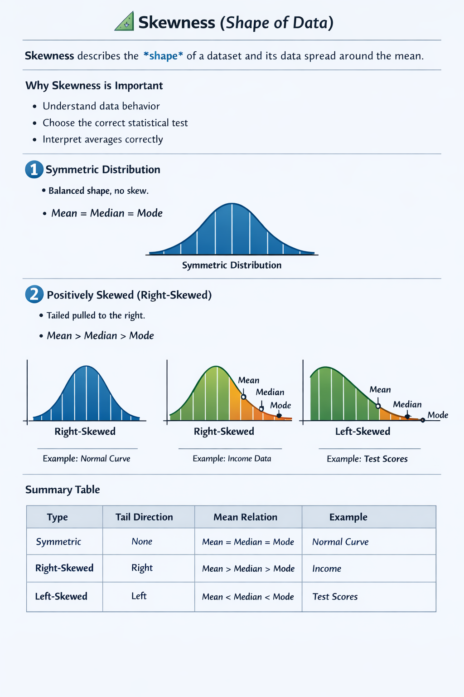

# 📘 Hypothesis Testing amd T-test

---

## 1️⃣ Measures of Central Tendency  

These describe the **center** of data.

### Mean (Average)  
Mean = (Sum of all values) / Number of values  

Example:  
60, 70, 80  
Mean = (60 + 70 + 80) / 3 = 70  

### Median  
Middle value when data is ordered.  
60, 70, 80 → Median = 70  

### Mode  
Most frequent value.  
60, 70, 70, 80 → Mode = 70  

---

## 2️⃣ Skewness (Shape of Data)



**Skewness** describes the **shape of a dataset** and shows how the data is **distributed around the mean**.

It tells us whether the data is:

* Balanced
* Pulled to the right
* Pulled to the left

Understanding skewness helps us interpret **averages**, choose the **right statistical test**, and understand **real-world data patterns**.

---

### 🔹 1. Symmetric Distribution

A **symmetric** distribution has an equal spread on both sides of the center.

#### Characteristics

* Mean = Median = Mode
* Balanced shape
* No skew

#### Example

Normal distribution 🔔
Exam scores centered around 70

```
      *
    *   *
  *       *
    *   *
      *
```

---

### 🔹 2. Positively Skewed (Right-Skewed)

The **tail is longer on the right side**.

#### Characteristics

* Mean > Median > Mode
* Few **very large values** pull the mean to the right
* Most data is on the left

#### Example

Income data 💰
Most people earn average salaries, but a few earn very high salaries

```
****  
  ****  
     ******  
```

---

### 🔹 3. Negatively Skewed (Left-Skewed)

The **tail is longer on the left side**.

#### Characteristics

* Mean < Median < Mode
* Few **very small values** pull the mean to the left
* Most data is on the right

#### Example

Easy exam scores 📝
Most students score high, few score very low

```
      ******  
   ****  
****  
```

---

### 📊 Skewness Summary Table

| Type         | Tail Direction | Mean Relation        | Example      |
| ------------ | -------------- | -------------------- | ------------ |
| Symmetric    | None           | Mean = Median = Mode | Normal curve |
| Right-Skewed | Right          | Mean > Median > Mode | Income       |
| Left-Skewed  | Left           | Mean < Median < Mode | Easy exam    |

---

### 📌 Key Exam Tips

* **Right-skewed** → High values pull the mean right
* **Left-skewed** → Low values pull the mean left
* **Symmetric** → Balanced data

---

## 📁 Important File Setup

Make sure your folder looks like this:

```
project-folder/
│
├── hypothesis_testing.md
└── An_educational_infographic_image_explains_skewness.png
```


## 3️⃣ Normal Distribution  

A **bell-shaped curve** 🔔  
Mean = Median = Mode  

### 68–95–99.7 Rule

| Range | % of Data |
|-------|-----------|
| μ ± 1σ | 68% |
| μ ± 2σ | 95% |
| μ ± 3σ | 99.7% |

Example:  
If mean = 70, SD = 10  
• 68% of scores are between 60 and 80  

---

## 4️⃣ Z-Score  

Measures how far a value is from the mean.

Z = (x − μ) / σ  

Example:  
Score = 80  
Mean = 70  
SD = 5  

Z = (80 − 70) / 5 = 2  

Meaning:  
The score is **2 SD above** the mean.

---

## 5️⃣ Z-Table (Standard Normal Table)

| Z | Area to Left |
|----|-------------|
| 0.00 | 0.5000 |
| 1.00 | 0.8413 |
| 1.96 | 0.9750 |
| -1.00 | 0.1587 |

### How to Read  
1. Row = first two digits  
2. Column = decimal  
3. Value = probability to the left  

Example:  
Z = 1.23 → Area ≈ 0.8907  
Meaning: 89.07% is below this value.

---

## 6️⃣ What is a Hypothesis?

A **hypothesis** is a statement about a population.

Example:  
"The average score is 70."

---

## 7️⃣ Hypothesis Testing  

Used to decide if a claim is **supported by data**.

Steps:  
1. State H₀ and H₁  
2. Choose test  
3. Calculate statistic  
4. Find p-value  
5. Make conclusion  

---

## 8️⃣ Null Hypothesis (H₀)

H₀ = No change / no effect  

Example:  
H₀: μ = 70  

---

## 9️⃣ Alternative Hypothesis (H₁)

H₁ = There is a change  

| Type | Meaning |
|------|---------|
| μ ≠ 70 | Two-tailed |
| μ > 70 | Right-tailed |
| μ < 70 | Left-tailed |

---

## 🔟 Significance Level (Alpha, α)

α = Probability of wrong decision  

Common value:  
α = 0.05  

Meaning:  
5% risk of rejecting a true H₀.

---

## 1️⃣1️⃣ P-Value  

The **p-value** shows how likely the result is **if H₀ is true**.

| p-value | Decision |
|----------|----------|
| p ≤ α | Reject H₀ |
| p > α | Do not reject H₀ |

---

## 1️⃣2️⃣ Z-Test (Large Sample, σ Known)

### When to Use  
• n ≥ 30  
• σ known  
• Testing a mean  

### Formula  
Z = (x̄ − μ) / (σ / √n)

### Example  

Claim: μ = 500  
Sample mean = 495  
σ = 10  
n = 36  

Z = (495 − 500) / (10 / 6)  
Z ≈ −3  

p ≈ 0.0026  

### Conclusion  
p < 0.05 → Reject H₀  
Bottles are **underfilled**.

---

## 1️⃣3️⃣ One-Sample T-Test  

### When to Use  
• n < 30  
• σ unknown  
• Compare to known value  

### Example  

Scores: 65, 68, 75, 80, 72  
Mean = 72  
SD ≈ 5.87  
n = 5  

t = (72 − 70) / (5.87 / √5)  
t ≈ 0.76  

df = 4  
t-critical = 2.776  

### Conclusion  
|0.76| < 2.776  
Do not reject H₀  
No significant difference.

---

## 1️⃣4️⃣ Independent T-Test  

### Purpose  
Compare **two different groups**  

### Example  

Class A mean = 70  
Class B mean = 78  

H₀: μ₁ = μ₂  
H₁: μ₁ ≠ μ₂  

Suppose p = 0.03  

### Conclusion  
p < 0.05 → Reject H₀  
The classes are **significantly different**.

---

## 1️⃣5️⃣ Paired T-Test  

### Purpose  
Compare **before vs after**  

### Example  

Before training: 60  
After training: 70  

H₀: μd = 0  

Suppose p = 0.01  

### Conclusion  
Reject H₀  
Training **improved performance**.

---

## 1️⃣6️⃣ T-Table (α = 0.05)

| df | t |
|----|----|
| 1 | 12.706 |
| 2 | 4.303 |
| 3 | 3.182 |
| 4 | 2.776 |
| 5 | 2.571 |
| 10 | 2.228 |
| ∞ | 1.960 |

How to use:  
1. Find df  
2. Choose α  
3. Pick tail  
4. Compare |t|  

---

## 1️⃣7️⃣ Chi-Square Test (χ²)

Used for **categorical data**.

### Example: Goodness of Fit  

A die is rolled 60 times.

| Outcome | Observed | Expected |
|--------|----------|----------|
| 1 | 8 | 10 |
| 2 | 9 | 10 |
| 3 | 12 | 10 |
| 4 | 11 | 10 |
| 5 | 10 | 10 |
| 6 | 10 | 10 |

χ² = 1.0  
df = 5  
Critical = 11.07  

### Conclusion  
1.0 < 11.07  
Do not reject H₀  
The die is **fair**.

---

## 1️⃣8️⃣ Chi-Square (Independence)  

### Example  

Survey: Gender vs Preference  

|        | Like | Dislike |
|--------|------|---------|
| Male   | 30   | 10 |
| Female | 20   | 20 |

Result: χ² = 6.5  
p = 0.01  

### Conclusion  
Reject H₀  
Preference depends on gender.

---

## 1️⃣9️⃣ ANOVA (3+ Groups)

### Purpose  
Compare **three or more means**  

### Example  

| Group | Mean |
|------|------|
| A | 70 |
| B | 75 |
| C | 85 |

p = 0.02  

### Conclusion  
Reject H₀  
At least one group is **different**.

---

## 2️⃣0️⃣ When to Use Each Test

| Situation | Test |
|----------|------|
| Large n, σ known | Z-test |
| Small n | T-test |
| Two groups | Independent T |
| Before/After | Paired T |
| Categorical | Chi-square |
| 3+ groups | ANOVA |

---

## 2️⃣1️⃣ Final Exam Summary  

• H₀ = No effect  
• H₁ = There is an effect  
• α = Significance level  
• p-value = Evidence strength  
• Reject H₀ = Significant  
• Z-test = Large sample  
• T-test = Small sample  
• Chi-square = Categories  
• ANOVA = Many groups  

---
